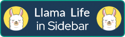

# 🔌 Browser Extensions

> ⚠ Note: this is a work-in-progress.

This monorepo[^1] contains the source code for my browser extensions. Its aim is to make maintenance easier.

## 📦 Contents

|                                                                                                                         |                                                                                                     |                                                                                                                     |
| ----------------------------------------------------------------------------------------------------------------------- | -------------------------------------------------------------------------------------------------------------- | :-----------------------------------------------------------------------------------------------------------------: |
|                                                                            | Adds Brave Search as a search engine option within Firefox. Also includes keyword @brave as a search shortcut. |  |
|                                                                          | Opens ChatGPT within the Firefox sidebar.                                                                      |  |
|                                                                          | Display Discord within the Firefox sidebar.                                                                    |  |
|                                                                        | Display Fastmail within the Firefox sidebar.                                                                   |  |
|                                                                                  | Display Gemini within the Firefox sidebar.                                                                     |  |
|                                      | Display Hacker News within the Firefox sidebar.                                                                |  |
|        | Display Llama Life within the Firefox sidebar.                                                                 |  |
|                   | Display Meta AI within the Firefox sidebar.                                                                    |  |
|         | A new tab replacement for your browser.                                                                        |  |
|                             | An extension that transforms the New Tab into a minimalist, auto-saving text editor.                           |  |
|  |                                                                                                                |  |
|             | Display Telegram within the Firefox sidebar.                                                                   |  |
|              | Display TickTick within the Firefox sidebar.                                                                   |  |
|                       | Opens TickTick in a pinned tab.                                                                                |  |
|               | Display WhatsApp within the Firefox sidebar.                                                                   |  |
|                | Opens WhatsApp in a pinned tab.                                                                                |  |
|                                                           | Reveal deeper information about text you highlight on a web page.                                              |  |

## ☑ Requirements

Two repository secrets are required to sign extensions prior releasing a new version with [web-ext](https://github.com/mozilla/web-ext).

- JWT Issuer: `FIREFOX_JWT_ISSUER`
- JWT Secret: `FIREFOX_JWT_SECRET`

Visit the [Manage API Keys](https://addons.mozilla.org/en-US/developers/addon/api/key/) page to obtain yours.

## © License

Source code in this repository is available under the [MIT License](LICENSE).

[^1]: In version-control systems, a monorepo ("mono" meaning 'single' and "repo" being short for 'repository') is a software-development strategy in which the code for a number of projects is stored in the same repository.
